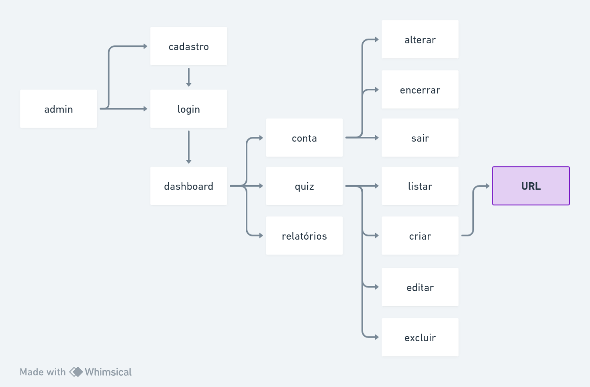

# Quizeiro

## 1. Objetivo

O propósito deste documento é estabelecer os requisitos e características da aplicação.

## 2. Descrição do Sistema

O **Quizeiro** é uma plataforma revolucionária que leva a criação de quizzes a um novo patamar, aproveitando o poder da inteligência artificial (IA) para proporcionar uma experiência única. Com o **Quizeiro**, você pode criar quizzes ilimitados, personalizá-los e compartilhá-los com seus amigos facilmente.

## 3. Partes interessadas

### Usuário

| Descrição     | Usuário que deseja criar e compartilhar um quiz personalizado e divertido." |
| ------------- | --------------------------------------------------------------------------- |
| Papel         | Gerar dados e acompanhar o progresso dos participantes;                     |
| Representante | Hugo Júnior                                                                 |

## 4. PERSONAS

### Administrador

| Descrição          | Usuário responsável por gerenciar o Quiz.                                        |
| ------------------ | -------------------------------------------------------------------------------- |
| Papel              | Criar, customizar e compartilhar o quiz.                                         |
| Insumos ao projeto | Cadastro das perguntas e demais informações relacionadas a customização do quiz. |
| Representante      | Hugo Júnior                                                                      |

### Usuário

| Descrição          | Usuário responsável por participar do Quiz.   |
| ------------------ | --------------------------------------------- |
| Papel              | Responder perguntas e ir avançando nos ranks. |
| Insumos ao projeto | Resposta das perguntas.                       |
| Representante      | Hugo Júnior                                   |

## 5. Necessidades e Funcionalidades

### 5.1. Área administrativa

- #N001. Banco de dados

  - #N001-F001: Modelar banco de dados;
  - #N002-F002: Criar migrations do projeto;
  - #N003-F002: Criar seeders para simulação;
  - #N004-F002: Criar Models das entidades;

- #N002. Login e Autenticação

  - #N001-F001: Criar serviço de login;
  - #N002-F002: Criar serviço de cadastro;
  - #N003-F002: Criar serviço de recuperação de conta;
  - #N004-F002: Criar gerenciamento de conta;

- #N003. Gerenciamento de Quiz

  - #N001-F001: Criar serviço de listagem;
  - #N001-F002: Criar serviço de cadastro;
    - Perguntas;
    - Respostas;
    - Customizações;
    - Integração com IA;
  - #N001-F003: Criar serviço de edição;
  - #N001-F004: Criar serviço de exclusão;

- #N004. APIs

  - #N001-F001: Criar API que fornece os dados do teste;
  - #N001-F002: Configurar limites da API e Cors;

- #N005. Relatórios
  - #N001-F001: Mostrar relatórios gerais sobre quizzes representados por gráficos;

### 5.2. Ambiente do Quiz

- #N006: Arquitetura interna

  - #N001-F001: Criar rotas dinâmicas para os testes;
  - #N001-F002: Organizar e adaptar assets e dependências do Phaser na aplicação;

- #N007: Informações dinâmicas

  - #N001-F001: Trocar informações estáticas por valores da API;
  - #N001-F002: Configurar meta tags para mostrar informações exclusivas do quiz pela sua url;

- #N008: Coleta de dados

  - #N001-F001: Enviar resultados finais para a API de ranks no final;
  - #N001-F002: Enviar informações gerais dos usuários para alimentar relatórios;

## 6. Arquitetura

| Recurso        | Contexto | Tecnologia   | Documentação                  |
| -------------- | -------- | ------------ | ----------------------------- |
| Linguagem      | Admin    | PHP          | https://www.php.net/          |
| Framework      | Admin    | Laravel      | https://laravel.com/          |
| Estilização    | Admin    | TailwindCSS  | https://tailwindcss.com/      |
| API            | Admin    | Json         | https://www.json.org/         |
| Banco de dados | Admin    | MySQL        | https://www.mysql.com/        |
| Linguagem      | Quiz     | JavaScript   | https://www.javascript.com/   |
| Framework      | Quiz     | Phaser       | https://phaser.io/            |
| Deploy         | Geral    | Docker       | https://www.docker.com/       |
| Hospedagem     | Geral    | DigitalOcean | https://www.digitalocean.com/ |

## 7. Configuração Ambiente

- Ambiente de desenvolvimento
  - Docker
- Versionamento
  - Git
  - Github
- IDEs
  - Banco de dados: **DataGrip**
  - Código: **PHPStorm**
- Teste de APIs
  - Postman

## 8. Fluxo

